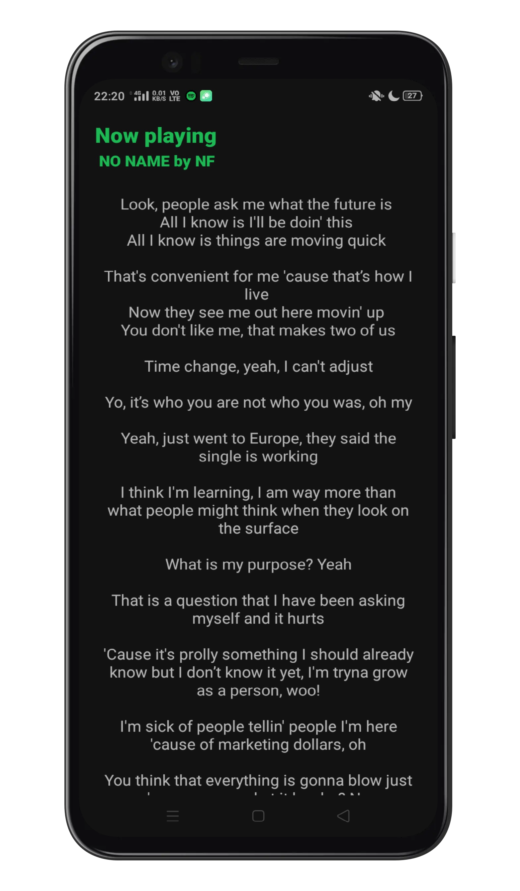

# SpotifyLyrics-Android
Shows lyrics for the current playing track on spotify.

Get the latest APK [here](https://github.com/ashar-7/SpotifyLyrics-Android/releases)

### Spotify SDK
The app uses [Spotify App Remote SDK](https://developer.spotify.com/documentation/android/) to subscribe to the player state in the Spotify app in your device.

[Register your app](https://developer.spotify.com/documentation/android/quick-start/#register-your-app) and put your Client ID and Redirect URI in [SpotifyManager.kt](app/src/main/java/com/se7en/spotifylyrics/ui/SpotifyManager.kt).

### [lyrics.ovh API](https://lyrics.ovh/)
No key required for this API. [Docs here](https://lyricsovh.docs.apiary.io/#).

### Screenshot

